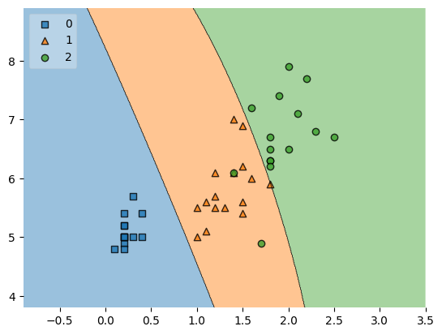

```python
import pandas as pd
import matplotlib.pyplot as plt
import seaborn as sns
```


```python
import warnings

warnings.filterwarnings('ignore')
```


```python
df = pd.read_csv('./Iris.csv')
```

### About Flower Features


```python
df.head()
```


<div>
<style scoped>
    .dataframe tbody tr th:only-of-type {
        vertical-align: middle;
    }

    .dataframe tbody tr th {
        vertical-align: top;
    }

    .dataframe thead th {
        text-align: right;
    }
</style>
<table border="1" class="dataframe">
  <thead>
    <tr style="text-align: right;">
      <th></th>
      <th>Id</th>
      <th>SepalLengthCm</th>
      <th>SepalWidthCm</th>
      <th>PetalLengthCm</th>
      <th>PetalWidthCm</th>
      <th>Species</th>
    </tr>
  </thead>
  <tbody>
    <tr>
      <th>0</th>
      <td>1</td>
      <td>5.1</td>
      <td>3.5</td>
      <td>1.4</td>
      <td>0.2</td>
      <td>Iris-setosa</td>
    </tr>
    <tr>
      <th>1</th>
      <td>2</td>
      <td>4.9</td>
      <td>3.0</td>
      <td>1.4</td>
      <td>0.2</td>
      <td>Iris-setosa</td>
    </tr>
    <tr>
      <th>2</th>
      <td>3</td>
      <td>4.7</td>
      <td>3.2</td>
      <td>1.3</td>
      <td>0.2</td>
      <td>Iris-setosa</td>
    </tr>
    <tr>
      <th>3</th>
      <td>4</td>
      <td>4.6</td>
      <td>3.1</td>
      <td>1.5</td>
      <td>0.2</td>
      <td>Iris-setosa</td>
    </tr>
    <tr>
      <th>4</th>
      <td>5</td>
      <td>5.0</td>
      <td>3.6</td>
      <td>1.4</td>
      <td>0.2</td>
      <td>Iris-setosa</td>
    </tr>
  </tbody>
</table>
</div>


```python
df.describe().T
```


<div>
<style scoped>
    .dataframe tbody tr th:only-of-type {
        vertical-align: middle;
    }

    .dataframe tbody tr th {
        vertical-align: top;
    }

    .dataframe thead th {
        text-align: right;
    }
</style>
<table border="1" class="dataframe">
  <thead>
    <tr style="text-align: right;">
      <th></th>
      <th>count</th>
      <th>mean</th>
      <th>std</th>
      <th>min</th>
      <th>25%</th>
      <th>50%</th>
      <th>75%</th>
      <th>max</th>
    </tr>
  </thead>
  <tbody>
    <tr>
      <th>Id</th>
      <td>150.0</td>
      <td>75.500000</td>
      <td>43.445368</td>
      <td>1.0</td>
      <td>38.25</td>
      <td>75.50</td>
      <td>112.75</td>
      <td>150.0</td>
    </tr>
    <tr>
      <th>SepalLengthCm</th>
      <td>150.0</td>
      <td>5.843333</td>
      <td>0.828066</td>
      <td>4.3</td>
      <td>5.10</td>
      <td>5.80</td>
      <td>6.40</td>
      <td>7.9</td>
    </tr>
    <tr>
      <th>SepalWidthCm</th>
      <td>150.0</td>
      <td>3.054000</td>
      <td>0.433594</td>
      <td>2.0</td>
      <td>2.80</td>
      <td>3.00</td>
      <td>3.30</td>
      <td>4.4</td>
    </tr>
    <tr>
      <th>PetalLengthCm</th>
      <td>150.0</td>
      <td>3.758667</td>
      <td>1.764420</td>
      <td>1.0</td>
      <td>1.60</td>
      <td>4.35</td>
      <td>5.10</td>
      <td>6.9</td>
    </tr>
    <tr>
      <th>PetalWidthCm</th>
      <td>150.0</td>
      <td>1.198667</td>
      <td>0.763161</td>
      <td>0.1</td>
      <td>0.30</td>
      <td>1.30</td>
      <td>1.80</td>
      <td>2.5</td>
    </tr>
  </tbody>
</table>
</div>


```python
# 3 unique types of flower
df['Species'].unique()
```


    array(['Iris-setosa', 'Iris-versicolor', 'Iris-virginica'], dtype=object)


```python
df = df.drop(['Id'],axis=1)
```


```python
bardf = df.groupby(['Species']).size().reset_index(name='count')
sns.barplot(data=bardf,x='Species',y='count')
plt.title("Number of Samples by Species")
plt.show()
```


    

    


```python
plt.figure(figsize=(10,10))

plt.subplot(2,2,1)
sns.boxplot(x= df['Species'],y=df['SepalLengthCm'])
plt.subplot(2,2,2)
sns.boxplot(x= df['Species'],y=df['SepalWidthCm'])
plt.subplot(2,2,3)
sns.boxplot(x= df['Species'],y=df['PetalLengthCm'])
plt.subplot(2,2,4)
sns.boxplot(x= df['Species'],y=df['SepalWidthCm'])
plt.show()
```


    

    


```python
sns.pairplot(df,hue='Species')
```


    <seaborn.axisgrid.PairGrid at 0x1836b958dc0>


    

    


```python
df.groupby(['Species']).count()
```


<div>
<style scoped>
    .dataframe tbody tr th:only-of-type {
        vertical-align: middle;
    }

    .dataframe tbody tr th {
        vertical-align: top;
    }

    .dataframe thead th {
        text-align: right;
    }
</style>
<table border="1" class="dataframe">
  <thead>
    <tr style="text-align: right;">
      <th></th>
      <th>SepalLengthCm</th>
      <th>SepalWidthCm</th>
      <th>PetalLengthCm</th>
      <th>PetalWidthCm</th>
    </tr>
    <tr>
      <th>Species</th>
      <th></th>
      <th></th>
      <th></th>
      <th></th>
    </tr>
  </thead>
  <tbody>
    <tr>
      <th>Iris-setosa</th>
      <td>50</td>
      <td>50</td>
      <td>50</td>
      <td>50</td>
    </tr>
    <tr>
      <th>Iris-versicolor</th>
      <td>50</td>
      <td>50</td>
      <td>50</td>
      <td>50</td>
    </tr>
    <tr>
      <th>Iris-virginica</th>
      <td>50</td>
      <td>50</td>
      <td>50</td>
      <td>50</td>
    </tr>
  </tbody>
</table>
</div>


```python
plt.figure(figsize=(4,3))
plt.title('Correlation Heatmap of Iris-Flowers')
ax = sns.heatmap(df.corr(), annot=True, square=True,  fmt='.2f',cmap='BuPu' )
ax.set_xticklabels(ax.get_xticklabels(), rotation=30)
ax.set_yticklabels(ax.get_yticklabels(), rotation=0)           
sns.axes_style("white")
plt.show()
```


    

    


# Classifier using 2 features
- PetalLengthCm
- PetalWidthCm


```python
from sklearn.preprocessing import LabelEncoder
from mlxtend.plotting import plot_decision_regions
from sklearn.model_selection import train_test_split
from sklearn.metrics import classification_report,confusion_matrix
from sklearn.decomposition import PCA
from sklearn.svm import SVC
import numpy as np
Labeler = LabelEncoder()
svm = SVC()
```


```python
def classifier2f(params,target):
    X = df[params]
    y = df[target]
    print('*'*55)
    print('Input Features:',params)
    print('Target Features:',target)
    y['Species'] = Labeler.fit_transform(df['Species'])
    X_train, X_test, y_train, y_test = train_test_split(X, y, test_size=.3, random_state=93)
    svm = SVC()
    svm.fit(X_train, y_train)
    print('Training Accuracy:',svm.score(X_train, y_train))
    print('Training Accuracy:',svm.score(X_test, y_test))
    y_pred = svm.predict(X_test)
    print(classification_report(y_test,y_pred))
    fig, ax = plt.subplots()
    plot_decision_regions(np.array(X_test), np.array(y_test[target[0]]), clf=svm, legend=2)
    plt.show()
```


```python
features = ['PetalLengthCm','PetalWidthCm','SepalLengthCm']
for i in range(0,3):
    for j in range(i+1,3):
        classifier2f([features[i],features[j]],['Species'])
```

    *******************************************************
    Input Features: ['PetalLengthCm', 'PetalWidthCm']
    Target Features: ['Species']
    Training Accuracy: 0.9809523809523809
    Training Accuracy: 0.9333333333333333
                  precision    recall  f1-score   support
    
               0       1.00      1.00      1.00        14
               1       0.93      0.88      0.90        16
               2       0.88      0.93      0.90        15
    
        accuracy                           0.93        45
       macro avg       0.94      0.94      0.94        45
    weighted avg       0.93      0.93      0.93        45
    
    


    

    


    *******************************************************
    Input Features: ['PetalLengthCm', 'SepalLengthCm']
    Target Features: ['Species']
    Training Accuracy: 0.9809523809523809
    Training Accuracy: 0.9555555555555556
                  precision    recall  f1-score   support
    
               0       1.00      1.00      1.00        14
               1       1.00      0.88      0.93        16
               2       0.88      1.00      0.94        15
    
        accuracy                           0.96        45
       macro avg       0.96      0.96      0.96        45
    weighted avg       0.96      0.96      0.96        45
    
    


    

    


    *******************************************************
    Input Features: ['PetalWidthCm', 'SepalLengthCm']
    Target Features: ['Species']
    Training Accuracy: 0.9619047619047619
    Training Accuracy: 0.9555555555555556
                  precision    recall  f1-score   support
    
               0       1.00      1.00      1.00        14
               1       0.89      1.00      0.94        16
               2       1.00      0.87      0.93        15
    
        accuracy                           0.96        45
       macro avg       0.96      0.96      0.96        45
    weighted avg       0.96      0.96      0.96        45
    
    


    

    


## 3 Feature SVM
- SepalLengthCm
- PetalLengthCm
- PetalWidthCm


```python
X = df[['SepalLengthCm','PetalLengthCm','PetalWidthCm']]
y = df[['Species']]
```


```python
y['Species'].unique()
```


    array(['Iris-setosa', 'Iris-versicolor', 'Iris-virginica'], dtype=object)


```python
y['Species'] = Labeler.fit_transform(df['Species'])
```


```python
y['Species'].unique()
```


    array([0, 1, 2])


```python

for i in range(0,200):
    
    X_train, X_test, y_train, y_test = train_test_split(X, y, test_size=.3, random_state=i)
    pca = PCA(n_components = 2)
    X_train2 = pca.fit_transform(X_train)
    X_test2 = pca.fit_transform(X_test)
    svm = SVC(kernel='rbf',degree=2,gamma=0.3)
    svm.fit(X_train2, y_train)
    y_pred = svm.predict(X_test2)
    #svm.fit(X_train, y_train)
    if svm.score(X_train2, y_train) > 0.999:
        print('*'*80)
        print(i)
        print('The accuracy of the svm classifier on training data is {:.2f} out of 1'.format(svm.score(X_train2, y_train)))
        print('The accuracy of the svm classifier on test data is {:.2f} out of 1'.format(svm.score(X_test2, y_test)))
        plot_decision_regions(np.array(X_test2), np.array(y_test['Species']), clf=svm, legend=2)
        plt.show()
        print(classification_report(y_test,y_pred))
        print('*'*80)
```

    ********************************************************************************
    80
    The accuracy of the svm classifier on training data is 1.00 out of 1
    The accuracy of the svm classifier on test data is 0.78 out of 1
    


    

    


                  precision    recall  f1-score   support
    
               0       1.00      0.89      0.94        19
               1       0.85      0.58      0.69        19
               2       0.47      1.00      0.64         7
    
        accuracy                           0.78        45
       macro avg       0.77      0.82      0.76        45
    weighted avg       0.85      0.78      0.79        45
    
    ********************************************************************************
    ********************************************************************************
    93
    The accuracy of the svm classifier on training data is 1.00 out of 1
    The accuracy of the svm classifier on test data is 0.87 out of 1
    


    

    


                  precision    recall  f1-score   support
    
               0       1.00      1.00      1.00        14
               1       0.78      0.88      0.82        16
               2       0.85      0.73      0.79        15
    
        accuracy                           0.87        45
       macro avg       0.87      0.87      0.87        45
    weighted avg       0.87      0.87      0.87        45
    
    ********************************************************************************
    ********************************************************************************
    147
    The accuracy of the svm classifier on training data is 1.00 out of 1
    The accuracy of the svm classifier on test data is 0.91 out of 1
    


    

    


                  precision    recall  f1-score   support
    
               0       1.00      1.00      1.00        15
               1       0.80      0.92      0.86        13
               2       0.93      0.82      0.87        17
    
        accuracy                           0.91        45
       macro avg       0.91      0.92      0.91        45
    weighted avg       0.92      0.91      0.91        45
    
    ********************************************************************************
    


```python
X_train, X_test, y_train, y_test = train_test_split(X, y, test_size=.3, random_state=147)
pca = PCA(n_components = 2)
X_train2 = pca.fit_transform(X_train)
X_test2 = pca.fit_transform(X_test)
svm = SVC(kernel='rbf',degree=2,gamma=0.3)
svm.fit(X_train2, y_train)
y_pred = svm.predict(X_test2)
#svm.fit(X_train, y_train)
print('*'*80)
print('The accuracy of the svm classifier on training data is {:.2f} out of 1'.format(svm.score(X_train2, y_train)))
print('The accuracy of the svm classifier on test data is {:.2f} out of 1'.format(svm.score(X_test2, y_test)))
plot_decision_regions(np.array(X_test2), np.array(y_test['Species']), clf=svm, legend=2)
plt.show()
print(classification_report(y_test,y_pred))
print('*'*80)
```

    ********************************************************************************
    The accuracy of the svm classifier on training data is 1.00 out of 1
    The accuracy of the svm classifier on test data is 0.91 out of 1
    


    

    


                  precision    recall  f1-score   support
    
               0       1.00      1.00      1.00        15
               1       0.80      0.92      0.86        13
               2       0.93      0.82      0.87        17
    
        accuracy                           0.91        45
       macro avg       0.91      0.92      0.91        45
    weighted avg       0.92      0.91      0.91        45
    
    ********************************************************************************
    

## Seems like 4 Featured SVM doesnt work that much while not having cost
